# Pet Vet
<p align="center">
  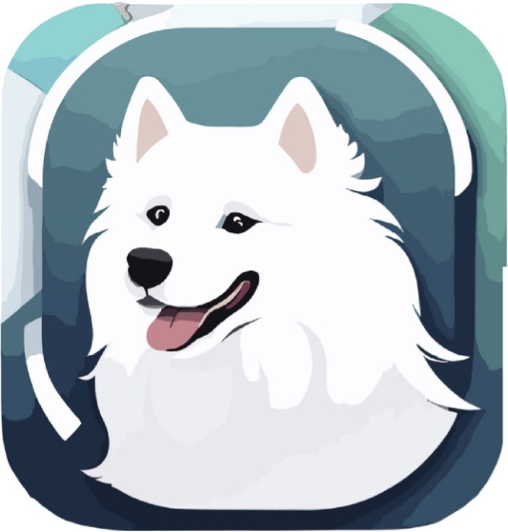
</p>

## Description

**Pet Vet** is an iOS application built with Swift that allows you to receive real-time acceleration and breathing data from compatible boards such as the nRF52840 or Arduino Nano BLE via Bluetooth Low Energy (BLE). The app provides users with valuable features, including:

- Real-time graph plotting for visualizing data.
- A comprehensive history record for monitoring your pet's motion and breathing.
- Motion prediction capabilities, allowing you to track your dog's activities like moving, standing, sitting, and lying down.
- Easy access to historical data for informed pet care.

## Table of Contents

- [Installation](#installation)
- [Usage](#usage)
- [Features](#features)
- [Screenshots](#screenshots)
- [Contributing](#contributing)
- [License](#license)

## Installation

To get started with **Pet Vet**, follow these steps:

### Prerequisites

- An iOS device with Bluetooth capability.
- [Xcode](https://developer.apple.com/xcode/) (version 15 beta or higher) installed on your development machine.

### Step 1: Clone the Repository

Clone this repository to your local machine using Git:

```bash
git clone https://github.com/yourusername/pet-vet.git 
```
### Step 2: Open the Project in Xcode

Open the project in Xcode by double-clicking the `PetVet.xcodeproj` file.

### Step 3: Build and Run

Connect your iOS device to your computer and select it as the build target. Then, click the "Build and Run" button in Xcode to install **Pet Vet** on your device.


### Step 4: Start Monitoring

Once connected, you can start monitoring your pet's motion and breathing in real-time. Explore the app's features to view graphs and historical data.

That's it! You're now ready to use **Pet Vet** to keep track of your pet's well-being.

## Usage

In **Pet Vet**, we've designed a user-friendly interface to help you monitor and care for your pet effectively. Follow these steps to make the most of the app's features:

### Connecting to the BLE Board

To start monitoring your pet, you need to establish a connection with the compatible BLE board (nRF52840 or Arduino Nano BLE):

- Launch **Pet Vet** on your iOS device.

- Navigate to the home screen by tapping on the "next" icon in the app's bottom navigation bar.
 <p align="center">
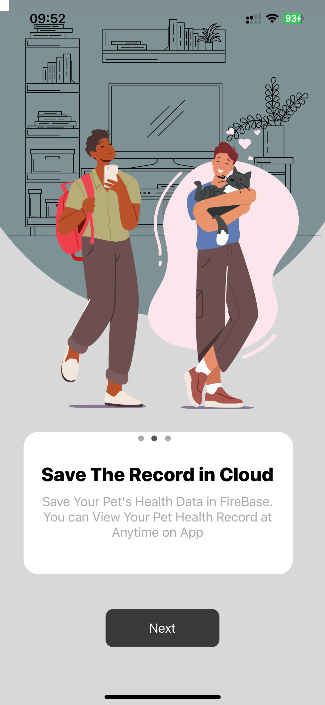 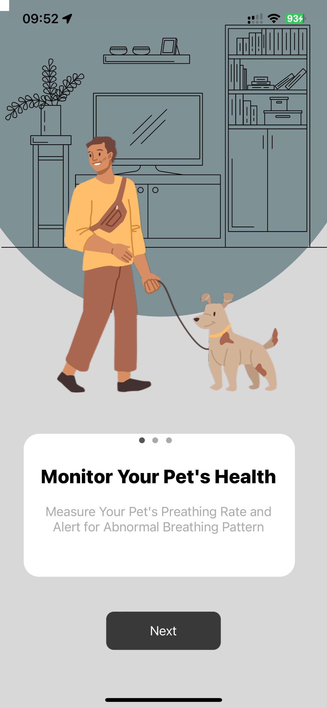 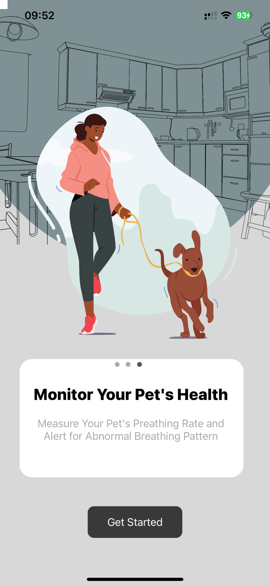
 </p>
- Tap the "Sign up" button to create new account.
 <p align="center">
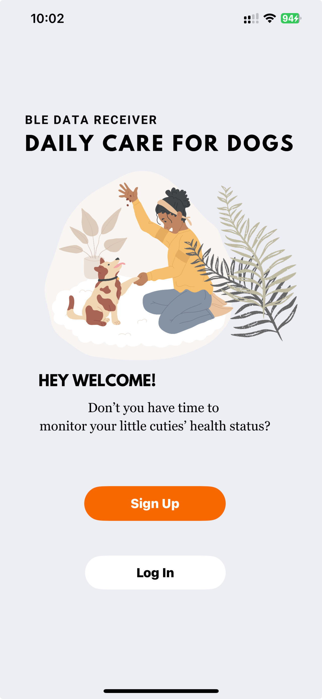 
 </p>
- fill the detail about your pet.
 <p align="center">
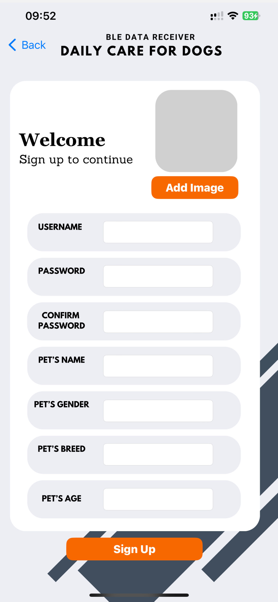 
 </p>
- Log in your Account.
 <p align="center">
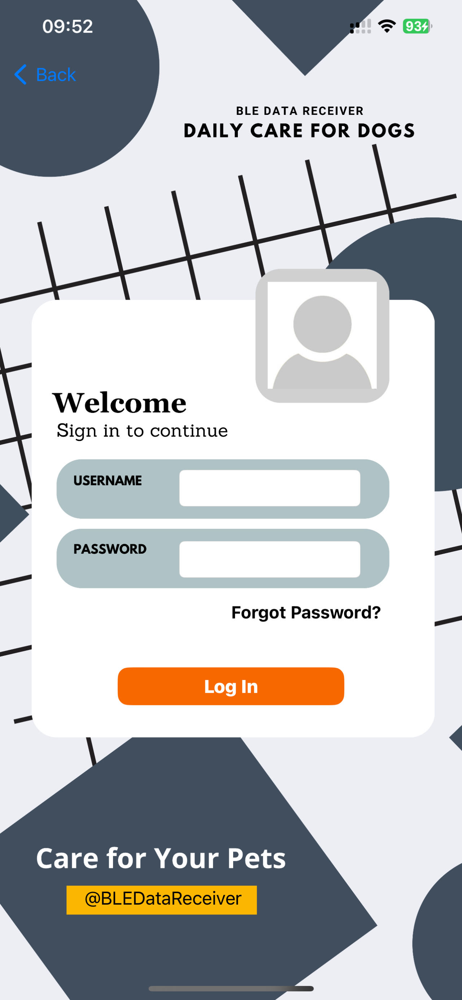 
 </p>

- Tap "Option one" to use Real-time Monitor and the tap the device you want to connect.
 <p align="center">
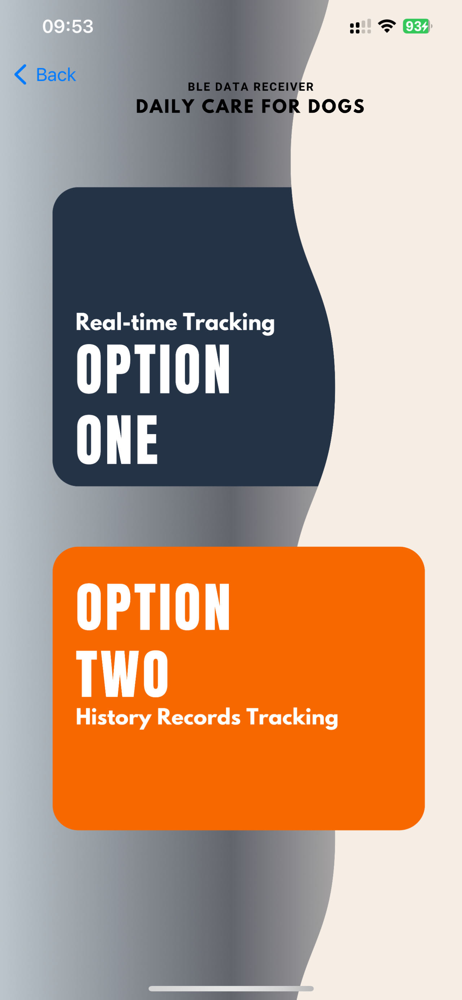 
 </p>
 
- Once "Connected" show up , you can tap it again to use view Real-Time Data.

### Real-Time Data Visualization

**Pet Vet** allows you to visualize your pet's acceleration and breathing data in real-time. Here's how to do it:

- when connected to the board you can view acceleration and breathing graph.
- Tap the tab at the top, you can switch between acceleration and breathing graph
- Current motion state and breathing rate is displayed on acceleration and breathing graph respectively.
<p align="center">
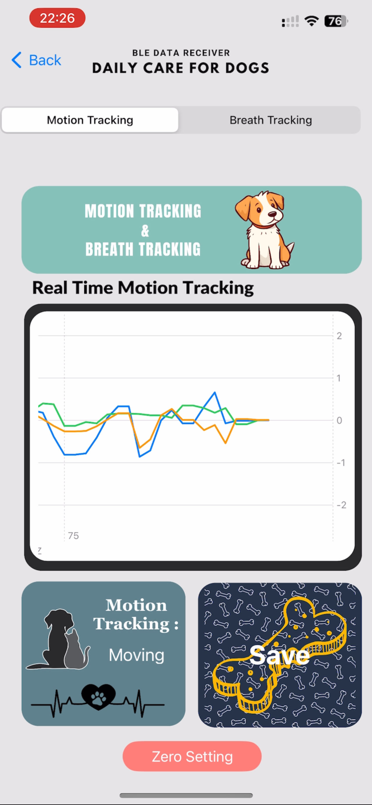 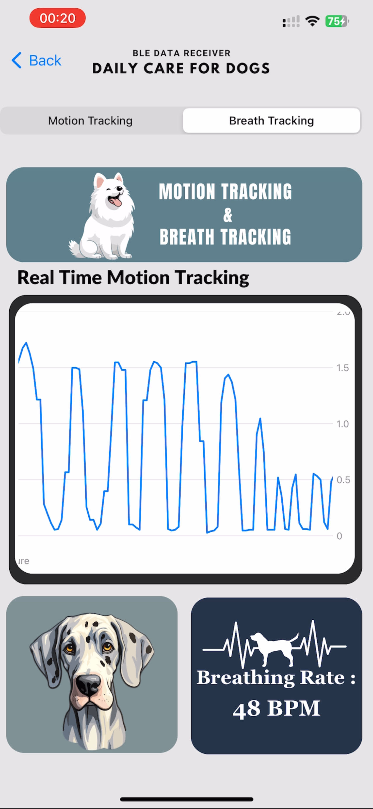 
 </p>


### Viewing History Records

**Pet Vet** keeps a comprehensive history of your pet's motion and breathing data, allowing you to review past activity. Here's how to access and explore these records:

- Go to the "Option two" tab in the app.

- Select the date or time range you want to review by using the date picker.
 <p align="center">
 
 </p>
- This history can assist you in tracking your pet's well-being over time.
  <p align="center">
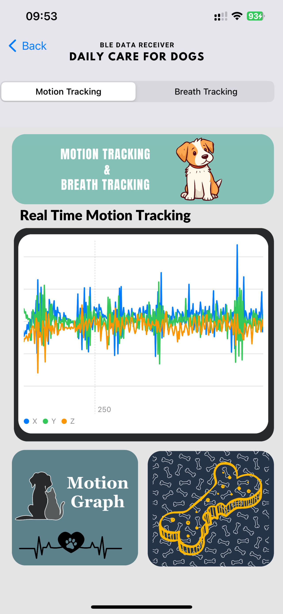 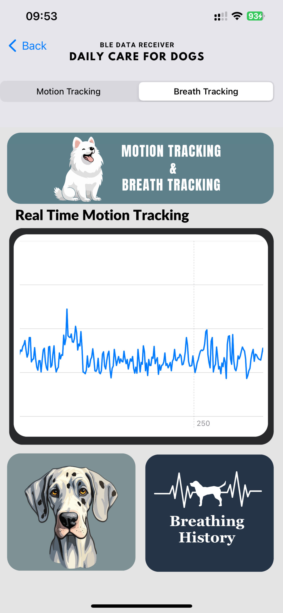 
 </p>

Now that you know how to connect, visualize data, predict motion, and review historical records, you can effectively use **Pet Vet** to care for your furry friend.

## Features

List the main features of your app in a bulleted or numbered list format. Be concise and clear in describing each feature. Highlight what makes your app unique and why users should be excited about it.

- **Real-time Data Reception:** Receive real-time acceleration and breathing data from compatible boards (nRF52840 or Arduino Nano BLE) via Bluetooth Low Energy (BLE).

- **Data Visualization:** Visualize data through real-time graph plotting, providing immediate insights into your pet's well-being.

- **Motion Prediction:** Predict your pet's current motion, including activities like moving, standing, sitting, or lying down.

- **Breathing Rate Measurement:** Monitor and measure your pet's breathing rate in real-time, helping you keep track of their health.

- **Comprehensive History Records:** Keep a detailed history of your pet's motion and breathing data, enabling you to track trends and changes over time.

- **User-Friendly Interface:** Enjoy an intuitive and user-friendly interface designed for pet owners, making it easy to use and understand.


- **Privacy and Security:** Rest assured that your pet's data is kept private and secure, firebase is safe platform to save your data.


### License

In the "License" section, you specify the license under which your project is available:

```markdown
## License

**Pet Vet** is open-source and available under the [MIT License](LICENSE).

You are free to use, modify, and distribute this software under the terms of the MIT License. See the [LICENSE](LICENSE) file for the full text of the license.

Please note that while **Pet Vet** is open-source and free to use, it may contain third-party libraries or dependencies with their own licenses. Make sure to review and comply with the licenses of those components before using them in other projects.
```
### Acknowledgements

- This project is supervised by [Dr.Yasin Cotur](https://github.com/ysnctr).
- Many thanks for Yuchen Ma for UI design.
Your contributions have been instrumental in making this project a success.
